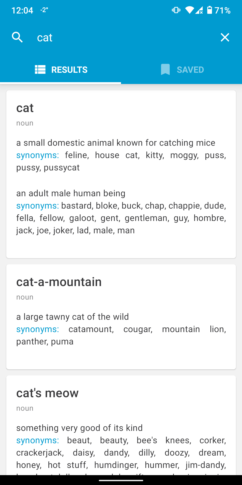
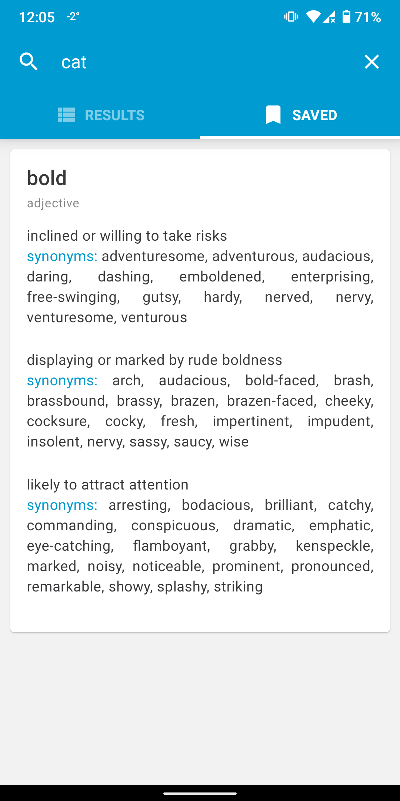

# Thesar

Thesaurus app written with React Native that shows cards with synonyms and short definitions for words. You can also save your favorite cards for easy access by long pressing on them.

<div style="display: flex; justify-content: space-around">
  
  
</div>

## Libraries used

Tab navigation:

- [React Navigation](https://github.com/react-navigation/react-navigation)

Material design:

- [React Native Paper](https://github.com/callstack/react-native-paper)

State managment:

- [Redux Toolkit](https://github.com/reduxjs/redux-toolkit)
- [Redux Persist](https://github.com/rt2zz/redux-persist)

## Known problems

Due to a [bug](https://github.com/callstack/react-native-paper/issues/3009) in React Native Paper library, switching between dark/light theme causes crash most of the times.

## Installing

You can either install the apk from the releases section or build it yourself.
To build it from the source, clone the repo and run

```bash
yarn install
cd android && ./gradlew assembleRelease
```
